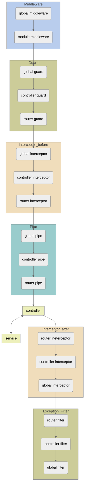

NestJS practice \_ kalix

## ------------------- command ----------------------

- $ nest g co \_\_dir : make dir for controller
- $ nest g resource **dir : make dir for crud of **dir resource

## ------------------- provider ---------------------

! process business logic

- service
- repository
- factory
- helper

- @Injectable
- @Inject

## ------------------ pipe use for-------------------

- transformation : input data transformation
- validation : validation check [..input]

- ValidationPipe
- ParseIntPipe : parsing string to int
- ParseBoolPipe :
- ParseArrayPipe
- ParseUUIDPipe
- DefaultValuePipe : set default inputValue

## ----------------- useful library -----------------

- class-validator : check dto validation

## --------------- using transaction ----------------

use when rollback DB status

- 1. using QueryRunner

  const queryRunner = this.dataSource.createQueryRunner();

  await queryRunner.connect();
  await queryRunner.startTransaction();

```
  try {
    ...
    await queryRunner.manager.save();

    await queryRunner.commitTransaction();

  } catch (e) {
    await queryRunner.rollbackTransaction();
  } finally {
    await queryRunner.release();
  }
```

- 2. using transaction function

```
  await this.dataSource.transaction(... => {

    await manager.save(user);

    // throw new InternalServerErrorException();
  })
```

## ------------------ middleware --------------------

# role of middleware

- 1. could excute any form of code
- 2. could manipulate request/response
- 3. could terminate the request/response cycle
- 4. if multiple middlewares are used, could pass control to the next middleware in the stack using 'next()'

# action of middleware

- 1. parsing cookie
  - Transform into an easily usable data structure
- 2. manage session
  - Retrieve the state of a session
- 3. authentication/authorization
  - Verify user access permissions. \*\* recommend using guards
- 4. parsing body

  - Read and interpret data, then pass it on

## --------- JWT authentication/authorization -------

|client| ===http call===> |guard| ======> |RouteHandler(@RequestMapping)|

# authentication : 401 Unauthorized

- using middleware
- could not access ExecutionContext

# authorization : 403 Forbidden

- using guard (could access ExecutionContexst insatance)

## --------------------- JWT ------------------------

- header : encoding base64

```
{
  "typ" :"JWT",
  "alg" :"HS256"
}
```

- payload : encoding base64

```
{
  "iss" : issure: string | url
  "sub" : subject: string | url
  "aud" : audience: url
  "exp" : expiration: UNIX Epoch time
  "nbf" : not befor: UNIZ Epoch time // disable before set time
  "iat" : issued at // issued time
  "jti" : JWI ID
}
```

- signature

# sliding session & refresh token

## -------------------- logging ---------------------

# @netjs/common - Logger

- {error, warn, log, verbose, debug} = Logger

## ---------------- exception filter ----------------

- specific endpoint :
  @UseFilters(HttpExceptionFilter)
- at controller :
  @UseFilters(HttpExceptionFilter)
- at main.ts :
  app.useGlobalFilters(new HttpExceptionFilter());
- at app.module.ts :

```
{
  provide: APP_FILTER,
  useClass: HttpExceptionFilter,
}
```

## ------------------- interceptor ------------------

- method 실행 전/후 추가 로직을 바인딩
- 함수에서 변환된 결과를 변환
- 함수에서 던져진 예외를 반환
- 기본 기능의 동작을 확장
- 특정 조건에 따라 기능을 재정의(ex, caching)

# middleware versus interceptor

- middleware : routehandler 전달되기 전
- interceptor : routehandler 처리 전/후

!! The usage is similar to an above exception filter.

- at main.ts :
  app.useGlobalInterceptors(new LoggingInterceptor());

## -------------- implement vs extend ---------------

# implement

interface ILogger {
log(message: string): void;
}

class ConsoleLogger implements ILogger {
log(message: string): void {
console.log(message);
}
}

# extend

```
class Animal {
  move(): void {
    console.log('Moving...');
  }
}

class Dog extends Animal {
  bark(): void {
    console.log('Woof!');
  }
}
```

## --------------- lifeCycle ------------------------



- middleware : 전역 -> imports내 정의 순서
- guard : wjsdur -> controller내 정의 순서
- interceptor :
  요청 : 전역 -> 컨트롤러 -> 라우트
  응답 : 라우터 -> 컨트롤러 -> 전역
- pipe :

```
@UsePipes(GeneralValidationPipe)
@Controller('users')
export class UserController {
  constructor(private usersService: UsersService) {}

  @UsePipies(RouteSpecificPipe)
  @Patch(':id')
  updateUser(
    @Body() body: UpdateUserDTO,
    @Param() params: UpdateUserParams,
    @Query() query: UpdateUserQuery
  ) {
    return this.usersService.updateUser(body, params, query)
  }
}
```

GeneralValidationPipe[query -> params -> body] ->
RouteSpecificPipe[query -> params -> body]
순으로 진행

- exception filter : 라우터 -> 컨트롤러 -> 전역

## --------------- task scheduling ------------------------

npm i --save @nestjs/schedule @types/cron

Three methods to declare task scheduling

- 1. declare cron job

```
  @Cron('* * * * *', { name: 'cronTask' })
  handleCron() {
    this.logger.log('Task Called');
  }
```

- 2. declare interval

```
  @Interval('intervalTask', 3000)
  handleInterval() {
    this.logger.log('Task Called by interval');
  }
```

- 3. declare setTimeout

```
@Timeout('timeoutTask', 5000)
  handleTimeout() {
    this.logger.log('Task Called by timeout');
  }
```

# dynamic scheduling
- using SchedulerRegistry

## --------------- health check ------------------------
using Terminus(@nestjs/terminus)

# provided function
- HttpHealthIndicator
- MongooseHealthIndicator
- TypeOrmHealthIndicator
- SequelizeHealthIndicator
- MicroserviceHealthIndicator
- MemoryHealthIndicator
- GRPHealthIndicator
- DiskHealthIndicator

## Separation of Concerns using CQRS
- CQRS9command query responsibility separation pattern)
  : 명령(command)와 조회(query)를 분리

using npm install @nestjs/cqrs